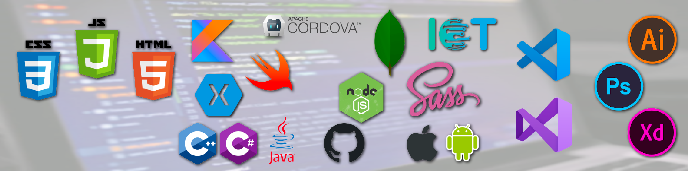

### Hi there 👋 ...I'm Luis!  \<FullStackDeveloper />

#### 🤔 A bit about me
&nbsp;&nbsp;&nbsp;&nbsp;&nbsp;🤹 Highly-skilled software development professional bringing more than 10 years in background. 
&nbsp;&nbsp;&nbsp;&nbsp;&nbsp;💻 Advanced knowledge of 📱 Mobile, 🌐 Application and 🕸️ Web programming languages. 
&nbsp;&nbsp;&nbsp;&nbsp;&nbsp;📚 Education and experience focused on both sides - business & tech, and also project management, leadership and design. 
&nbsp;&nbsp;&nbsp;&nbsp;&nbsp;😔 Unfortunately, most of my best projects were developed for private companies with signed NDAs(here but in private repos). 

#### ⚡ Happening now
&nbsp;&nbsp;&nbsp;&nbsp;&nbsp;🏋️‍ I’m currently working as a Software Developer at [PHD Solutions](https://phdsolutions.ca/) and on a revolutionary iOS Retail App called [Fitted](https://www.findmyfit.io/). 
&nbsp;&nbsp;&nbsp;&nbsp;&nbsp;📖 And I’m also studying AWS ☁️ Cloud development to get certified. 

#### 😜 Fun facts
&nbsp;&nbsp;&nbsp;&nbsp;&nbsp;🎮 Video game player & enthusiast 
&nbsp;&nbsp;&nbsp;&nbsp;&nbsp;🤓 Overall geek and smart but not nerd 😊 
&nbsp;&nbsp;&nbsp;&nbsp;&nbsp;🍔 Burger and 🥩 BBQ lover (prepping and eating) 

#### 💬 Where to find more stuff
&nbsp;&nbsp;&nbsp;&nbsp;&nbsp;💼 [My personal profile and skills page](https://appdevcanada.github.io)
