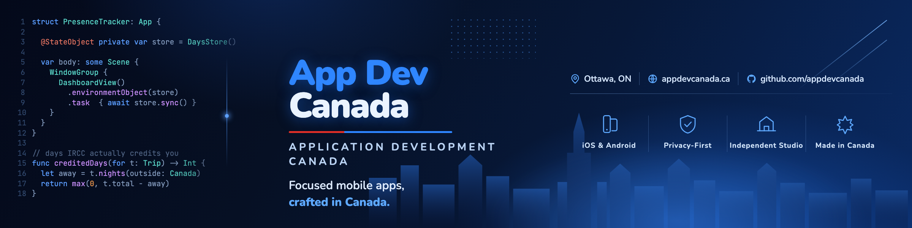

# Hi there 👋 I'm Luis!

### Senior Frontend Engineer | UI/UX Specialist | 70/30 Full-Stack Architect

I am a software development professional with over 10 years of experience building products at the intersection of **Business**, **Technology**, and **Design**. I specialize in creating high-performance, accessible (WCAG) web applications using the **React/TypeScript** ecosystem.

---

### 🤔 A bit about me

- 🤹 **Experience at Scale:** 10+ years background spanning Enterprise (Insurance/Banking), Startups, and Cloud solutions.
- 💻 **Tech Stack:** Advanced knowledge of **Web, Mobile, and Application** architectures. I focus on the Frontend but speak "Backend" fluently (AWS, Node, .NET).
- 📚 **Business-Minded:** My education is split between Tech and Business Management, which helps me lead teams and manage high-stakes project budgets.
- 💼 **Professional Portfolio:** Much of my high-impact work (for multi-million dollar insurance and logistics firms) is tucked away in private repos under NDA—but I bring that enterprise-grade rigour to every public project I touch.

### ⚡ Happening now

- 🏋️ **Current Role:** Building scalable platforms as a **Senior Developer at PHD Solutions**.
- 📖 **Always Learning:** Currently deep-diving into advanced **AWS Serverless patterns** and **Performance Optimization** for massive datasets.

---

### 😜 Fun facts

- 🎮 **Gamer:** Video game player and enthusiast.
- 🤓 **Geek Level:** Proud geek. Smart, social, and always curious.
- 🍔 **Foodie:** Dedicated Burger and 🥩 BBQ lover—both the prep and the eating!

---

### 🛠 My Daily Toolkit

- **Frontend:** React, TypeScript, Redux, Material UI, SASS, WCAG 2.0 AA
- **Backend/Cloud:** Node.js, ASP.NET (C#), GraphQL, AWS (Lambda, S3, API Gateway)
- **Mobile:** Swift (ARKit), Kotlin, .NET Maui
- **Design:** Figma, Design Thinking, Information Architecture

---

### 📫 Let's Connect!

[LinkedIn](https://linkedin.com/in/luishsouza) | [Portfolio](https://appdevcanada.vercel.app) | [Email Me](mailto:appdevcanada@gmail.com)

